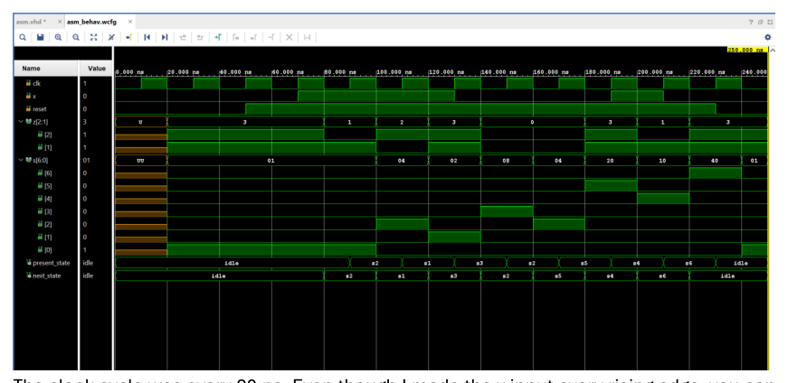
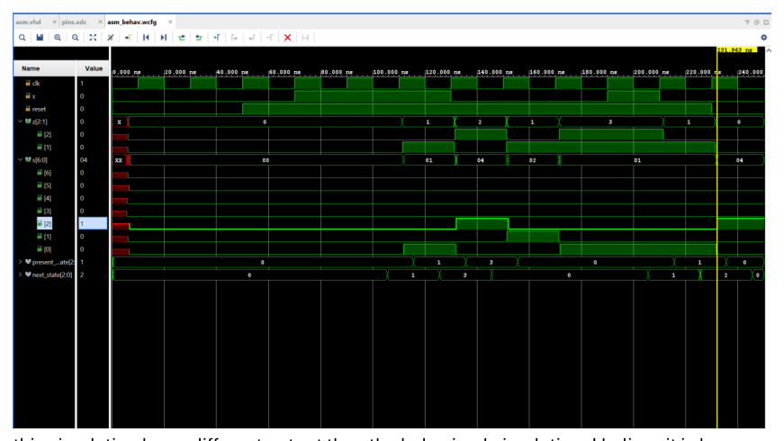
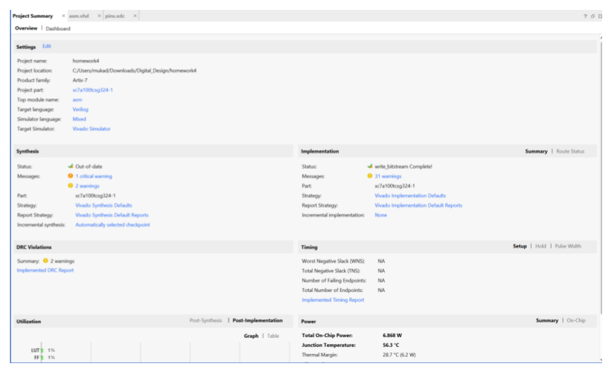
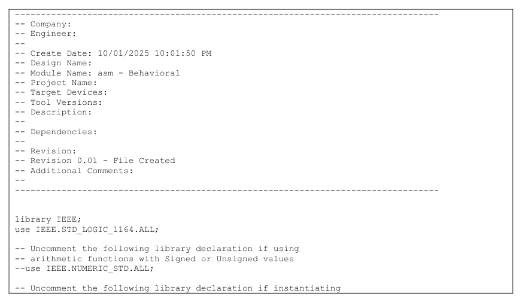
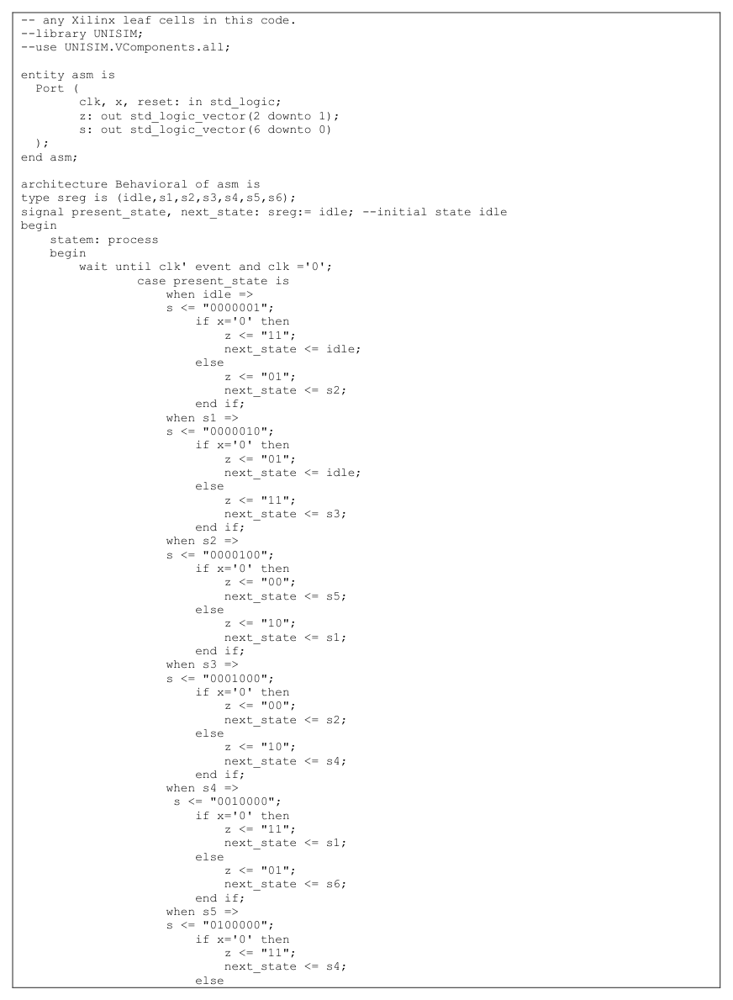
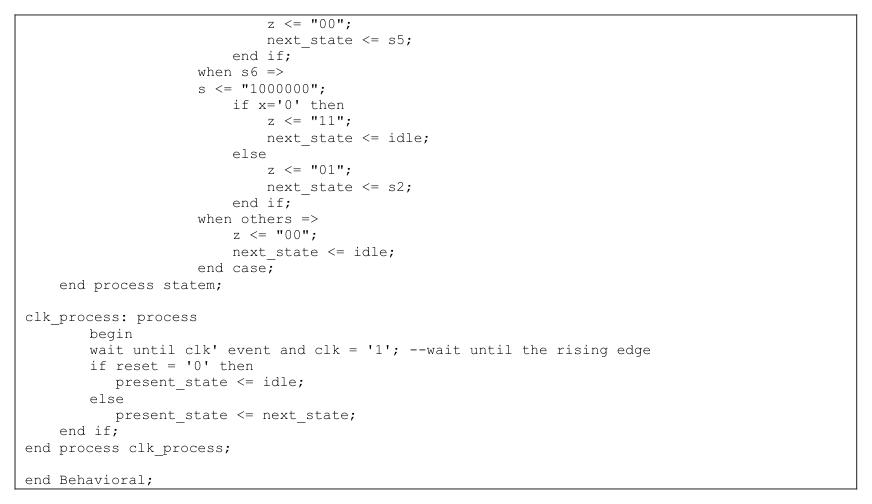
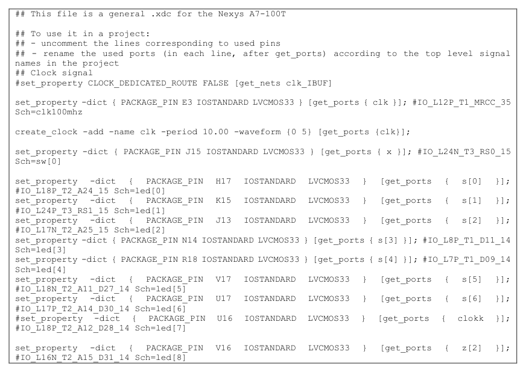
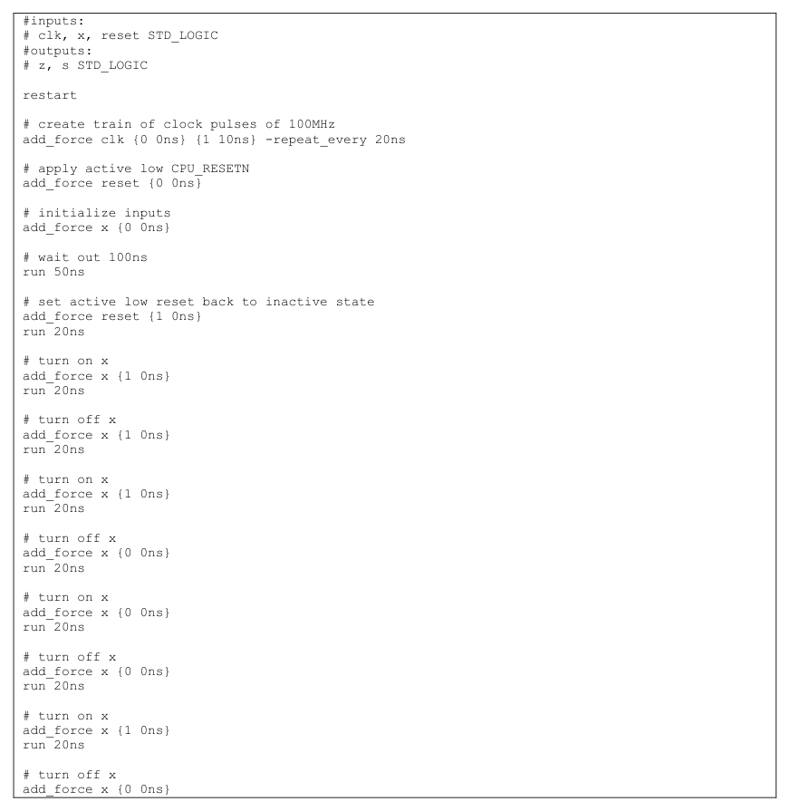
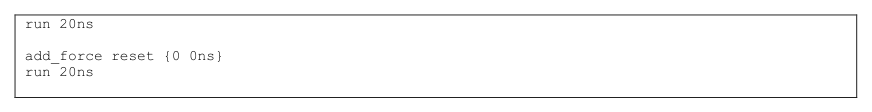

#  ASM / FSM Controller in VHDL (Nexys A7)

A 7‑state ASM/FSM controller (`idle`, `s1`…`s6`) written in VHDL and verified in simulation with a Tcl force script.  
The interesting twist here is timing: **`next_state` is computed on the falling edge**, while **`present_state` only updates on the rising edge** — so the waveforms clearly show them changing at different times.

---

## GitHub title

**ASM/FSM Controller (VHDL) — Nexys A7**

## GitHub description (1–2 sentences)

7‑state ASM/FSM controller in VHDL for the Nexys A7, with `next_state` evaluated on the falling clock edge and `present_state` updated on the rising edge; verified using Tcl-driven simulation waveforms and on-board LED mapping.

---

## What it does

- States: `idle`, `s1`, `s2`, `s3`, `s4`, `s5`, `s6`
- Inputs: `clk`, `x`, active‑low `reset`
- Outputs:
  - `s[6:0]` = state indicator bits (LEDs)
  - `z[2:1]` = output bits based on current state + `x`
- Reset forces the FSM back to `idle`

---

## Core implementation idea (two processes)

### 1) Next‑state + outputs (falling edge)

```vhdl
statem: process
begin
  wait until clk'event and clk = '0';
  case present_state is
    when idle =>
      s <= "0000001";
      if x='0' then
        z <= "11";
        next_state <= idle;
      else
        z <= "01";
        next_state <= s2;
      end if;

    -- s1..s6 cases omitted here for brevity
  end case;
end process statem;
```

### 2) State register (rising edge)

```vhdl
clk_process: process
begin
  wait until clk'event and clk = '1';
  if reset = '0' then
    present_state <= idle;
  else
    present_state <= next_state;
  end if;
end process clk_process;
```

---

## Simulation (Tcl forcing)

The Tcl script:
- generates a clock
- pulses `reset`
- toggles `x` in a pattern that hits every state at least once

```tcl
restart
add_force clk {0 0ns} {1 10ns} -repeat_every 20ns
add_force reset {0 0ns}
add_force x {0 0ns}
run 50ns

add_force reset {1 0ns}
run 20ns
add_force x {1 0ns}
run 20ns
# ... keep stepping x to walk the ASM ...
```

---

## Hardware mapping (Nexys A7)

- `clk`  → `clk100mhz`
- `x`    → `SW0`
- `reset`→ `BTNL`
- `s[0..6]` → `LED0..LED6`
- `z[2]` → `LED8`
- `z[1]` → `LED9`

---

## Screenshots

### Behavioral simulation waveform


### Post-implementation simulation waveform


### Vivado project summary


### VHDL source (header)


### VHDL FSM logic (main)


### VHDL state register (tail)


### XDC pin mapping


### Tcl force script (part 1)


### Tcl force script (part 2)


---

## Demo video

I also have a video uploaded above showing the project functioning.
